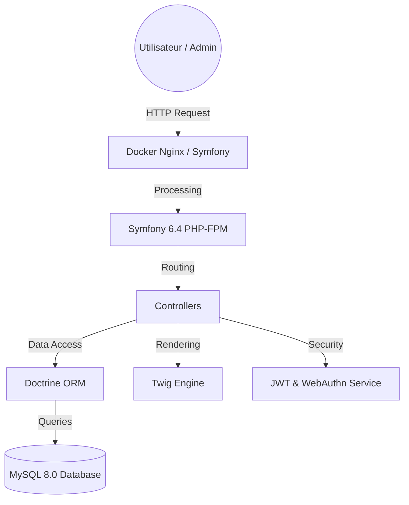
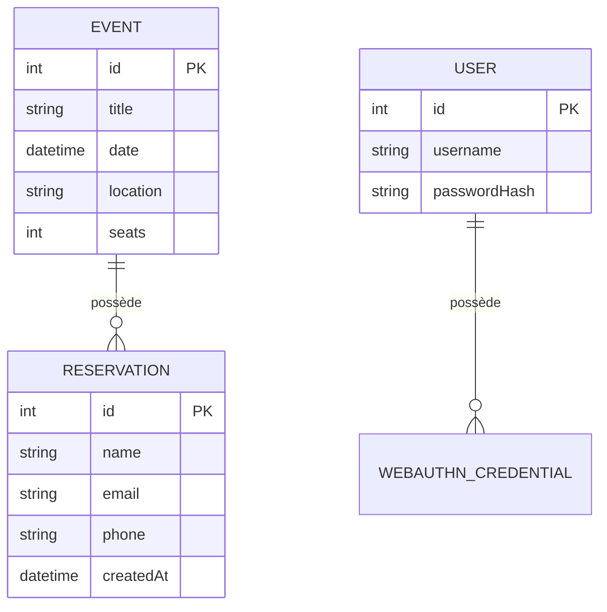
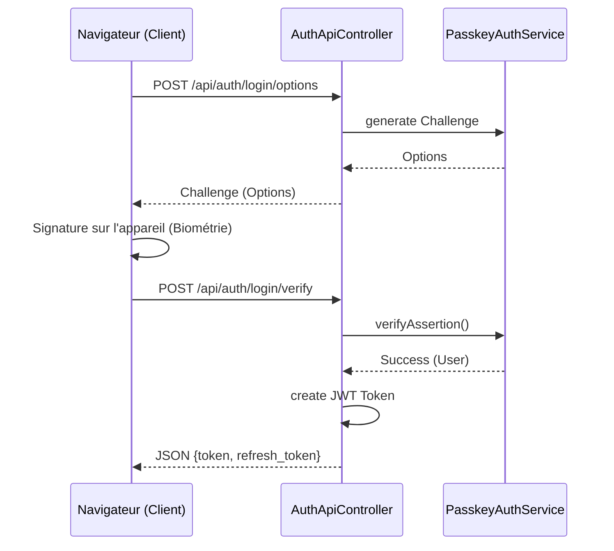
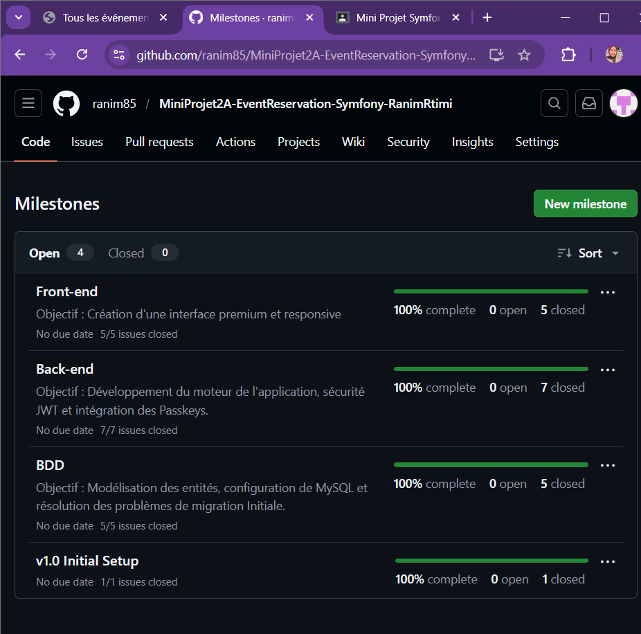

# Rapport de Projet : Application de Gestion de Réservations d'Événements

**Auteur :** Ranim Rtimi  
**Classe :** FIA2-GL  
**Enseignant :** M. Sofiene Ben Ahmed  
**Institution :** ISSAT Sousse  
**Année Universitaire :** 2025-2026

---

## 1. Introduction

Ce rapport présente le développement d'une application web complète pour la gestion de réservations d'événements. L'objectif principal était de concevoir une plateforme sécurisée et esthétique permettant aux utilisateurs de s'inscrire à des événements tout en offrant une interface d'administration robuste pour la gestion des contenus.

Les défis majeurs de ce projet incluaient l'intégration de technologies de pointe comme les **Passkeys (système sans mot de passe)** et les tokens **JWT (JSON Web Token)** pour la communication API.

---

## 2. Architecture Technique et Stack Technologique

L'application repose sur une architecture moderne utilisant des outils performants :

- **Framework Back-end :** Symfony 6.4 (Version LTS).
- **Moteur de Templates :** Twig (avec intégration Bootstrap 5).
- **Base de Données :** MySQL 8.0 gérée via Doctrine ORM.
- **Serveur Web :** Serveur local Symfony / Serveur Web intégré à Docker.
- **Conteneurisation :** Docker 
- **Sécurité :** JWT (Lexik), WebAuthn (Passkeys).

> [!NOTE] 
> **Architecture Logicielle** : Nous avons opté pour une séparation claire entre la logique métier (Controllers), les accès aux données (Repositories) et les vues (Twig).



## 3. Conception de la Base de Données (BDD)

La base de données a été modélisée pour répondre aux besoins de flexibilité et d'intégrité des données.

### Entités principales :
1. **Event** : Gère les informations sur les événements (titre, description, date, lieu, nombre de places).
2. **Reservation** : Stocke les participations liées à un événement spécifique.
3. **User** : Gère les utilisateurs classiques (Passkey/Password).
4. **Admin** : Gère les accès au panneau d'administration.



---

## 4. Sécurité et Authentification Moderne

C'est le cœur technique du projet, mettant en œuvre deux mécanismes de sécurité complémentaires.

### 4.1 Authentification JWT
Pour les échanges API, l'application génère un token JWT unique après chaque connexion réussie. Ce token permet des appels sécurisés et stateless.

**Exemple de Firewall (`security.yaml`) :**

```yaml
security:
    firewalls:
        api_login:
            pattern: ^/api/auth/login
            stateless: true
        api:
            pattern: ^/api
            stateless: true
            jwt: ~
```

### 4.2 Intégration des Passkeys (WebAuthn)
Nous avons implémenté l'authentification biométrique/physique via les Passkeys, permettant une connexion sans mot de passe sécurisée par le protocole WebAuthn.

> [!IMPORTANT]
> **Flux WebAuthn** : Challenge envoyé par le serveur -> Signature par l'appareil client -> Vérification cryptographique par le serveur.



**Extrait du contrôleur d'authentification :**

```php
// src/Controller/AuthApiController.php
#[Route('/login/verify', methods: ['POST'])]
public function loginVerify(Request $request, PasskeyAuthService $passkeyService): JsonResponse {
    $assertionData = json_decode($request->getContent(), true)['credential'];
    $user = $passkeyService->verifyLogin($assertionData);
    
    return $this->json([
        'token' => $this->jwtManager->create($user),
        'refresh_token' => $this->refreshManager->createForUser($user)->getRefreshToken()
    ]);
}
```


---

## 5. Réalisation des Fonctionnalités

### 5.1 Côté Utilisateur
Le frontend a été conçu avec une esthétique **Premium (Glassmorphism)**. Un utilisateur peut :
- Consulter la liste des événements.
- Voir les détails (description longue, date précise).
- Remplir un formulaire de réservation avec validation en temps réel.


### 5.2 Côté Administrateur
L'administrateur dispose d'un espace sécurisé (`/admin/events`) pour effectuer toutes les opérations de gestion (CRUD).

- **Dashboard** : Liste globale.
- **CRUD** : Formulaires de création et édition.
- **Suivi** : Consultation de la liste des réservations par événement.


---

## 6. Méthodologie et Workflow (GitHub)

Le développement a suivi une approche agile basée sur les branches Git et les **Milestones** GitHub.

- **Branches** : Utilisation de `main` pour le stable, `dev` pour l'intégration et de branches `feature/` dédiées.
- **Milestones** : Validation par étapes (Milestone 1 : BDD, Milestone 2 : Back, Milestone 3 : Front
Milestone 4 :v1.0 Initail Setup).



---

## 7. Problèmes Rencontrés et Solutions

| Problème | Solution |
| :--- | :--- |
| Conflit de version WebAuthn et PHP 8.5 | Utilisation de `giann/webauthn-lib:^4.5` compatible PHP 8.x. |
| Incohérence des ports MySQL (Docker) | Rectification du port `3307` dans le fichier `.env`. |
| Erreur de détection des tests unitaires | Correction des Namespaces et des suffixes de classes en `*Test.php`. |
| Erreur "Invalid Domain" Passkey | Synchronisation du `APP_DOMAIN` avec l'origine réelle (`localhost`). |
| Erreur 500 RefreshTokenManager | Injection du `RefreshTokenGeneratorInterface` pour remplacer la méthode obsolète `createForUser`. |

---

## 8. Conclusion

Ce projet a permis d'explorer en profondeur les fonctionnalités avancées de Symfony 6.4. L'intégration de technologies modernes de sécurité comme les Passkeys place cette application dans une démarche actuelle de cybersécurité. L'interface utilisateur, alliant minimalisme et esthétique premium, offre une expérience fluide et "wow" dès la première utilisation.

---
© 2026 - Ranim Rtimi - ISSAT Sousse
